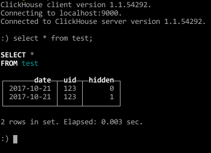

# ch-encode
Clickhouse typesafe RowBinary insert data encoder generator for Go. Supported types:

String | FixedString(N) | UIntX | IntX | EnumX | Array(T)|FloatX|Nested<sup>*</sup>|Nullable(T)|
-------|----------------|-------|------|-------|---------|------|------|--------|

> <sup>*</sup>Nested types are supported in the same sense they are used in the Clickhouse itself: despite having clearly 
nested declaration they are represented as ordinary fields with dotted names (`[nested name].[subfield name]`) with DB level
constraint on these fields (what are ordinary arrays of subfield's types) having the same length. We did the same: there's encoder level control implemented for Raw and Testing encoders for these arrays' length. There's no syntactic level grouping for them.

## The problem
* Tables can be wide and thus generating proper INSERT statements is a source of errors itself.
* Proper data buffering on INSERT statements is a bit tricky

## Solution
* Take Clickhouse table. Map it into the function call (column → function parameter)
* Function generates binary data in Clickhouse RowBinary format. Buffering became trivial (special bufferer is needed anyway - 
function call output which represents a table record must not be splitted)

## Problems raised
* Scheme desync - this can be detected with autogenerated tests, where the state of table scheme will be stored and then compared to current scheme

## Bonuses
* Testing mock objects can be generated as well.
* It is fast as it avoids any allocation in a process and RawBinary should be the easiest format (I don't know exactly though) after Native for the Clickhouse.


# How to use
```bash
go get github.com/sirkon/ch-encode
```
then
```bash
ch-encode --date-field date table1 table2 … tableN
```
will generated N packages in the current folder with autogenerated encoders and desync tests. Use `--date-field ''` in case if the table doesn't have any `Date` field.

Example.

1. Let's create clickhouse table
    ```sql
    CREATE TABLE test
    (
        date Date, 
        uid String, 
        hidden UInt8
    ) ENGINE = MergeTree(date, (date, uid, hidden), 8192);
    ```
2. Let we have translation dictionary translation.yaml
    ```yaml
    uid: UID
    ```
    we use translation in order uid to be translated into UID in generated code. Something like
    `first_uid` or `firstUid` will be translated into `firstUID` as well.
3. Now generate encoder
    ```bash
    bin/ch-encode --yaml-dict=translation.yaml test
    ```
    test directory will appear in current directory, it will have two go files, test.go and test_test.go.
    this is **test** package. Move it into src to be seen by **go install**
 4. Get [ch-insert](https://github.com/sirkon/ch-insert) package:
    ```
    go get -u github.com/sirkon/ch-insert
    ```
 5. Now, some code
    ```go
    // file main.go
    package main
     
    import (
     	"net/http"
     	"test"
     	"time"
     
     	chinsert "github.com/sirkon/ch-insert"
    )
     
    func main() {
     	rawInserter := chinsert.New(
     		&http.Client{},		   // HTTP client is defined explicitly in order to utilize
     					   // stdlib provided feautures such as proxy support if needed
     		chinsert.ConnParams{	   // clickhouse connection parameters
     			Host: "localhost",
     			Port: 8123,
     		},
     		"test",			   // table name
     	)
     
     	inserter := chinsert.NewBuf(rawInserter, 10*1024*1024)
     	defer inserter.Close()
     	encoder := test.NewTestRawEncoder(inserter)
     	if err := encoder.Encode(test.Date.FromTime(time.Now()), test.UID("123"), test.Hidden(1)); err != nil {
     		panic(err)
     	}
     	if err := encoder.Encode(test.Date.FromTime(time.Now()), test.UID("123"), test.Hidden(0)); err != nil {
     		panic(err)
     	}
    }

    ```
6. See test table now

    
    
# Details
Let's see into the generated test.go file.

There's test encoder
```go
type TestEncoder interface {
	Encode(date DateType, uid UID, hidden Hidden) error
	InsertCount() int
	ErrorCount() int
}
```

And there are 4 types that implements TestEncoder:
```go
type TestRawEncoder {}           // Regular RowBinary data generator
type TestRawEncoderDateFilter{}  // Will only generate data for a given date
type TestRawEncoderVoid{}        // Will not generate anything
type TestingTestEncoder{}        // For testing purposes
```

We saw how the TestRawEncoder works. Bother TestRawEncoderDateFilter and TestRawEncoderVoid work the same way. Let's see how to use TestingTestEncoder:
```go
package main

import (
	"test"
	"time"

	"github.com/sanity-io/litter"
)

func main() {
	e := test.NewTestingTestEncoder()
	date := time.Date(2006, 1, 2, 3, 4, 5, 0, time.UTC)
	err := e.Encode(
		test.Date.FromTime(date),
		test.UID("123123"),
		test.Hidden(1))
	if err != nil {
		panic(err)
	}
	err = e.Encode(
		test.Date.FromTime(date),
		test.UID("321321"),
		test.Hidden(0))
	if err != nil {
		panic(err)
	}

	litter.Dump(e.Result)
}

```
this program will output
```go
[]test.TestingTestResult{
  test.TestingTestResult{
    Date: "2006-01-02",
    UID: "123123",
    Hidden: 1,
  },
  test.TestingTestResult{
    Date: "2006-01-02",
    UID: "321321",
    Hidden: 0,
  },
}
```
Good for testing, you see. 
DateTime type will be represented as `%Y-%m-%dT%H:%M:%S` string, enums will be represented as their text values. Other clickhouse types match directly into Golang equivalents (Int16 -> int16, Float64 -> float64, UInt32 -> uint32, nullables as pointers to types except `Nullable(Array(T))` which are represented as regular `[]τ` slices, etc)
